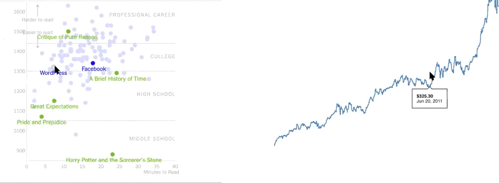

# Critical Data & Visualization 👁 Spring 2021

Welcome! This page will be filled with material and links throughout the semester. I recommend to **bookmark it now**.

- **Instructor**: Leon Eckert, [leon.eckert@nyu.edu](mailto:leoneckert@nyu.edu)
- **Class Times**: Mondays & Wednesdays, 9:45pm-11:00pm
- **Class Slack**: Invitation via e-mail.
- **Class Location**: Cyberspace (Zoom links will be shared on Slack)
- **Office Hours**: Tuesdays 3-5pm, Thursdays 10-11am （[sign up](https://calendar.google.com/calendar/u/0/selfsched?sstoken=UUE0X1AyMVlCNnpyfGRlZmF1bHR8ZTBmYjk2MTcyMjZkZmUwMzhjYTllN2IxMzlkMmQ4MTU)）
- [Official Sylląbus](https://drive.google.com/file/d/1e8sWJFPTEWgzIva-jq-z6yCrTb-3LN_u/view?usp=sharing) (accessible with NYU e-mail address)

#### Quick Links

- [current assignments](current-assignments/README.md)
- [Useful Resources](other/resources)
- [Grading Breakdown](https://docs.google.com/spreadsheets/d/1xZ4tSFMJCH11FTI8_gmNv8zuGVfems1oiRgbb6Du3Ic/edit?usp=sharing)
- Problems with Zoom or other things? >> [NYU's Digital Teaching & Learning Toolkits](https://wp.nyu.edu/toolkits/)

#### Course Description

Data collection and algorithmic processing are not only central to recent technical breakthroughs such as in Artificial Intelligence and automation but have created new economic paradigms where data equals value and shape political approaches to power and control.

Decisions based on algorithms affect society at large whether it’s changing the way we transport and distribute goods, influencing the things we buy or the news we read. The world that algorithms see is data. For the average person, however, data is seldom more than an abstract idea.

So, what exactly is data? How is value extracted from it? And why should we care? How can we ethically balance the positive uses of data-driven systems with the threats they pose to discriminate and infringe basic human rights? This course seeks to untangle some of these issues practically and theoretically.

#### Content
- [Week 1](#january-25) - `cdv[0] = 'overview'`
- [Week 2](#February-1) - Data Types / Visualizations
- [Week 3](#February-8) - Human / Data
- **SPRING FESTIVAL**
- [Week 4](#February-22) - Human / Bias
- [Week 5](#March-1) - Surveillance Capitalism / Check-In
- [Week 6](#March-8) - Data Zine Project Presentations 🎉
- [Week 7](#March-15) - Prediction / Uncertainty
- [Week 8](#March-22) - 5x20
- [Week 9](#March-29) - Check-In
- **SPRING BREAK**
- [Week 10](#April-12) - Data Story: Contextual Report Presentations 📚
- ⛳️ [Week 11](#April-19) - Ethics / Privacy
- Week 12 - Check-In
- Week 13 - Resistance
- Week 14 - Data Story Project Presentations 🥂

<!-- # Week 1 -->

##### January 25
##### `cdv[0] = 'overview'`

- [Slides](https://docs.google.com/presentation/d/1NiWAiGBprd8YoxktMKkk6cv4QwbUoAxZouNqKvsHoMc/edit?usp=sharing)
- Intro
- Exercise: Distributed Research
- Course Overview
- [Roadmap](other/roadmap.pdf) (the grey vacation times are for reference only (not totally accurate!))
- Questions

###### Assignments

- 👾 Coding Exercise 1 (Foundation) *(due 1/27)*
- 🖍 Dear Data: Reading Visualizations *(due 2/1)*
- 📖 Reading 1 (Data Intro) *(due 2/7)*

🔗 [Assignment Details](current-assignments)

###### For your interest (optional):

- [Breaking The Black Box](https://www.propublica.org/blackbox), 4 videos with text, ProPublica (2016)
- Introduction, ["Raw Data" is an Oxymoron](https://mitpress.mit.edu/books/raw-data-oxymoron), Lisa Gitelman (2013)

---

##### January 27
##### `Collect Data`
*due today: Coding Exercise 1*

- Review: web basics
- Review: JS data structures
- JSON
- Collect and use data with Google Forms

[Details](labs/lab1) of today's Lab.

###### Assignments

- 👁Watch this [talk](https://vimeo.com/69448223) by Mike Bostock, Eyeo 2013 *(due 2/3)*
- 👾Coding Exercise 2 (Form Data, Vanilla JS) *(due 2/3)*

🔗[Assignment Details](current-assignments)

###### For your interest (optional):

- Online Exhibition: "[Data Visualization and the Modern Imagination](https://exhibits.stanford.edu/dataviz)"

<!-- # Week 2 -->

##### February 1
##### `Data Types / Visualizations`
*due today: Dear Data: Reading Visualizations*

- Data Type [Exercise](https://docs.google.com/spreadsheets/d/1tN3ky-FkUdI4t1f-GQTB4FIq05NSTX4z5U0iDnwGDVI/edit?usp=sharing) (35m)
- ([slides](https://docs.google.com/presentation/d/1HePclT33PZk2EymitL2-4JX7vAscwKyk-9owhUcIR1A/edit?usp=sharing))
- Present [Dear Data Visualizations](https://docs.google.com/spreadsheets/d/1PTTTbewj2zsqgztBhNZKB2ipunpI7jiok2tmm_kfhXE/edit#gid=0) I (20m)
- Announce [Data Zine Project](projects/data-zine) (20m)

###### Assignments

- 💡 Data Zine Subject Proposal *(due 2/8)*
- 🖼 Data Zine *(due 3/8)*

🔗[Assignment Details](current-assignments)

###### For your interest (optional):

- [You are Your Data: Self-Tracking Practices and Concepts of Data](https://www.researchgate.net/publication/303972155_You_are_Your_Data_Self-Tracking_Practices_and_Concepts_of_Data), Deborah Lupton (2016)

---

##### February 3
##### `Meet D3js I`
*due today: Coding Exercise 2, Mike Bostock Video*

- What is a library?
- Hi, D3!
  - pixels vs. SVG
  - examples
  - Data Driven Documents
- What you see when you see D3
  - Something dot something dot something semicolon
- Actual Intro to D3 (in video & text tutorial form)

[Details](labs/lab2) of today's Lab.

###### Assignments

- 👾 Coding Exercise 3 (Data-binding, JSON) *(due 2/10)*
- 📊 Read Edward Tufte's texts on Data Visualization *(due 2/24)*

🔗 [Assignment Details](current-assignments)

<!-- # Week 3 -->

##### February 8
##### `Human / Data`
*due today: Reading 1, Data Zine Subject Proposal*

- Discuss [Reading 1](readings/reading1) (40m)
- Present [Dear Data Visualizations](https://docs.google.com/spreadsheets/d/1PTTTbewj2zsqgztBhNZKB2ipunpI7jiok2tmm_kfhXE/edit#gid=0) II (15m)
- Share Plans for Data Zine (20m)

###### Assignments

- 📖 Reading 2 (Data Bias) *(due 2/21)*

🔗 [Assignment Details](current-assignments)

<!-- ###### For your interest (optional): -->

---

##### February 10
##### `Meet D3js II`
*due today: Coding Exercise 3*

- House Keeping:
  - please add your Data Zine description to this [Sheet](https://docs.google.com/spreadsheets/d/1Ms8Ov109hRn2spG1lVXUMSuEHlCPChz8Dmw4ShhD6BY/edit?usp=sharing)
  - a survey about pre-recorded lab videos, [here](https://forms.gle/zFsprpZJx4kNJpu29)
  - grading breakdown [here](https://docs.google.com/spreadsheets/d/1xZ4tSFMJCH11FTI8_gmNv8zuGVfems1oiRgbb6Du3Ic/edit?usp=sharing)
- The Lab:
  - Check out your [homework](https://github.com/leoneckert/critical-data-and-visualization-spring-2021/wiki/Coding-Exercise-3-(week-3))
  - Binding Data to Elements: Various Scenarios
  - Incoming Data: the enter-selection in detail
  - Tips & Tricks
  - Videos on Classes and Groups in D3

[Details](labs/lab3) of today's Lab.

###### Assignments

- 👾 Coding Exercise 4 (Grouping Elements) *(due 2/24)*
- ✂️ Data Zine Paper Prototype *(due 2/24)*

🔗 [Assignment Details](current-assignments)

<!-- ###### For your interest (optional): -->

# Week 4

##### February 22
##### `Human / Bias`
*due today: Reading 2*

- Welcome Back!
- Class Exercise ([Slides](https://docs.google.com/presentation/d/1QTz5HyTUGwRh-FG4s7EUh8O8-nvN7_pK4SNMk6N0VWk/edit?usp=sharing), [Working Sheets](https://docs.google.com/spreadsheets/d/1st2OzjfGh3_NOhZlU2jiHVLyTW68q0cj8NcN7LvsvSM/edit?usp=sharing) )
  - Intro (5m)
  - Working Time (25m)
  - Presentation (30)
  - Vote and Discuss (15m)

- today's exercise was originally designed by [Mimi Onuoha](https://mimionuoha.com/) and [Mother Cyborg (Diana Nucera)](http://www.mothercyborg.com/). It is published in their zine "[A People's Guide to AI (2018)](https://mimionuoha.com/a-peoples-guide-to-ai)". If you are curious to take a closer look, I can borrow you a copy :)

###### Assignments

- 📖 Reading 3 (Surveillance Capitalism) *(due 2/28)*

🔗 [Assignment Details](current-assignments)

<!-- ###### For your interest (optional): -->

---

##### February 24
##### `Intro to Scales`
*due today: Coding Exercise 4, Data Zine Paper Prototype, Tufte Reading*

- Questions
- Do people feel comfortable about JSON?
- Introducing: [Data Zine Coding Template](projects/data-zine/coding-template.zip) (10m)
- The Lab:
  - Check out your [coding exercises](https://github.com/leoneckert/critical-data-and-visualization-spring-2021/wiki/Coding-Exercise-4-(week-4))
  - intro to scales (with pictures) ([slides](https://docs.google.com/presentation/d/1mL81BbzNZWUPyvwf1Uil15Q9x6axwplP7MCXSGrH558/edit?usp=sharing))
  - live coding demo: high buildings
  - live coding demo: dead celebrities

[Details](labs/lab4) of today's Lab.

###### Assignments

- 🏗 Finished version of Data Zine *(due 3/3)*

🔗 [Assignment Details](current-assignments)

<!-- ###### For your interest (optional): -->

# Week 5

##### March 1
##### `Surveillance Capitalism / Check-In`
*due today: Reading 3*

- How to present the [Data Zine](projects/data-zine)
- 1-on-1 meetings
  - 5 minutes each. Please be prepared with material you want to show me.
  - Work on our project in the remaining class time.
  - In this order:
    - [X] Tina
    - [X] Shengli
    - [X] Clover
    - [X] Winny
    - [X] Alexis
    - [X] Linda
    - [X] Tom
    - [X] Zoe
    - [X] Jyoti
    - [X] Alex
    - [X] Layla
    - [X] Adrien
    - [X] Sarah
    - [X] Alan

###### Assignments

- 📖 Reading 4 (Prediction & Uncertainty) *(due 3/14)*

🔗 [Assignment Details](current-assignments)

<!-- ###### For your interest (optional): -->

---

##### March 3
##### `Review / Axis / Custom SVG shapes`
*due today: (Almost) Finished version of Data Zine*

- Check out your [Work In Progress](https://github.com/leoneckert/critical-data-and-visualization-spring-2021/wiki/Work-In-Progress-Version-of-Data-Zine-(week-5))
- Lab
  - Question Time ([sheet](https://docs.google.com/spreadsheets/d/1O5MJox90bXwSG15Ca61IafXhw3L-J9WTR_pCfPmkiR8/edit?usp=sharing))
  - Live-Coding Time
  - Videos reviewing learned concepts and introducing Axis and Custom Shapes

[Details](labs/lab5) of today's Lab.

<!-- ###### Assignments
🔗 [Assignment Details](current-assignments) -->

<!-- ###### For your interest (optional): -->

# Week 6

##### March 8
##### `Data Zine Presentations`
*due today: Data Zine*

- During the Presentations, **please help each other** by giving feedback, thoughts, ideas, inspiration in [this document](https://docs.google.com/document/d/1nsqtuA-rXT2j6TGQWAj2OEOgTpBQE1SDfLCTM-zORio/edit?usp=sharing).
- [Link To Wiki](https://github.com/leoneckert/critical-data-and-visualization-spring-2021/wiki/Data-Zine-Project-(week-6))
- Presentation Order:
  - [X] [Winny](https://winnyww.github.io/cdv-student/projects/datazine-template/cover.html) [video](https://youtu.be/3WkaMJvBYdY)
  - [X] [Zoe](https://zoexiao0516.github.io/cdv-student/projects/data-zine/cover.html)
  - [X] [Adrien](https://adrienven.github.io/cdv-student/projects/placeholder/Datazine/datazine-template/cover.html)
  - [X] [Sarah](https://sa4913.github.io/cdv-student/projects/FinalDataZine/cover.html) [video](https://youtu.be/Ohg1YXomAwA)
  - [X] [Alan](https://alanlechengchao.github.io/cdv-student/projects/data-zine/datazine/cover.html)
  - [X] [Tina](https://tinazhang226.github.io/cdv-student/projects/datazine-FinalV/cover.html)
  - [X] [Shengli](https://writecards.github.io/cdv-student/projects/data-zine/cover.html)
  - [X] [Tom](https://tomzhu1024.github.io/cdv-student/projects/datazine/cover.html)
  - [X] [Linda](https://lindaaali.github.io/CDV-Linda/projects/placeholder/datazine-template/cover.html)
  - [X] [Jyoti](https://koapush.github.io/cdv-student/projects/zine-project/cover.html)
  - [X] [Alex](https://alexwang624.github.io/cdv-student/projects/data-zine/data-zine/cover.htmlE)
  - [X] [Alexis](https://qp274.github.io/cdv/projects/datazine/cover.html)
  - [X] [Layla](https://shenshenl.github.io/cdv-student/projects/datazineTemplate/)
  - [X] [Clover](https://clover0208.github.io/cdv-student/projects/placeholder/datazine-template/cover.html)

###### Assignments

- 🤹 Two Data Stories  *(due 3/15)*

🔗 [Assignment Details](current-assignments)

<!-- ###### For your interest (optional): -->

---

##### March 10
##### `Time, Updates & Transitions`
<!-- *due today: * -->

- `Enter, Update, Exit, Transitions`, learned in four parts.

[Details](labs/lab6) of today's Lab.

###### Assignments

<!-- - shown in class -->
- 👾 Coding Exercise 5 (Roesling's Graph) *(due 3/17)*

🔗 [Assignment Details](current-assignments)

<!-- ###### For your interest (optional): -->

# Week 7

##### March 15
##### `Prediction & Uncertainty`
*due today: Reading 4, Two Data Stories*

- Discussing the Reading / Predictive Policing (25m)
- Present Found Data Stories (30m)
- Announce: [Data Story Contextual Report](projects/data-story-and-contextual-report-presentation) (15m)
  - Where are we on the [Roadmap](other/roadmap.pdf)?
- Announce: 5x20seconds: What's it all about? (5m)

###### Assignments

- 🍱 Three Good Datasets *(due 3/17)*
- 🚀 5x20seconds: What's it all about?  *(due 3/22)*
- 🗺 Data Story Contextual Report *(due 4/12)*

🔗 [Assignment Details](current-assignments)

###### For your interest (optional):

- [*This Is Not Minority Report*](https://read.dukeupress.edu/books/book/2588/chapter/1386046/This-Is-Not-Minority-Report-Predictive-Policing) (2019) by R. Joshua Scannell
- [*Dirty Data, Bad Predictions: How Civil Rights Violations Impact Police Data, Predictive Policing Systems, and Justice*](https://papers.ssrn.com/sol3/papers.cfm?abstract_id=3333423) (2019), by Richardson, Schultz, Crawford
- [Rabbit Hole](https://www.nytimes.com/column/rabbit-hole), Podcast by NY Times about Youtube's recommendation algorithm.

---

##### March 17
##### `Enter, Exit, Update`
*due today: Coding Exercise 5, Three Good Datasets*

- Check out previous [Coding Exercise](https://github.com/leoneckert/critical-data-and-visualization-spring-2021/wiki/Coding-Exercise-5-(week-7))
- Live Coding

[Details](labs/lab7) of today's Lab.

###### Assignments

- 👾 Coding Exercise 6 (Transitions) *(due 3/24)*

🔗 [Assignment Details](current-assignments)

# Week 8

##### March 22
##### `5x20`
*due today: 5x20seconds*

- audience:
  - 🤓 open this [shared document](https://docs.google.com/document/d/1_Vx52Vz_c-k-Nd9UwJJMIPkzQl6vZUtmbBcxPklR0gQ/edit?usp=sharing)
  - 🖊 take notes:
    - ✨ have you seen similar projects that could serve as **inspiration**?
    - 📚 **related** areas of **research** for them to look at?
    - 💡 general **advice or ideas** that can be helpful
- presenter:
  - 🥸 **present** (100 seconds)
  - 😅 take a **deep breath**
  - 🧐 **take notes** while the audience responds to your presentation (200 seconds)

- time for questions or studying [more reference projects you found](https://github.com/leoneckert/critical-data-and-visualization-spring-2021/wiki/Two-Data-Stories-(week-7)) (also: [resources](other/resources))

---

##### March 24
##### `Generators, Components, Layouts`
*due today: Coding Exercise 6*

- Check out previous [Coding Exercise](https://github.com/leoneckert/critical-data-and-visualization-spring-2021/wiki/Coding-Foundation-Exercise-(week8))
- Any coding difficulties or questions?
  - Who has downloaded their dataset and looked at it in Atom?

[Details](labs/lab8) of today's Lab.

###### Assignments

- 🕵️ Outline Research *(due 3/29)*
- 👾 Coding Exercise 7 (Line Generators) *(due 3/31)*

🔗 [Assignment Details](current-assignments)

# Week 9

##### March 29
##### `Check-In`
*due today: Outline Research*

- 1-on-1 meetings
  - 5 minutes each. Please be prepared with material you want to show me.
  - Work on our project in the remaining class time.
  - In this order:
    - [X] Winny
    - [X] Tom
    - [X] Zoe
    - [X] Tina
    - [X] Shengli
    - [X] Alan
    - [X] Layla
    - [X] Adrien
    - [X] Sarah
    - [X] Clover
    - [X] Jyoti
    - [X] Alex
    - [X] Alexis
    - [X] Linda

###### Assignments

- 📖 Reading 5 (Ethics) *(due 4/18)*

🔗 [Assignment Details](current-assignments)

---

##### March 31
##### `Maps`
*due today: Coding Exercise 7*

- labs ahead (maps, tooltips, scrolling interactions, force graphs)
- Quiz: I walk 1 km south, 1 km east, 1 km north. I am exactly where I started. Where am I?
- [Maps](http://maps.google.com/): How many Chinas fit into Russia?

[Details](labs/lab9) of today's Lab.

###### Assignments

- 👾 Coding Exercise 8 (Maps) *(due 4/21)*

🔗 [Assignment Details](current-assignments)

# Week 10

##### April 12
##### `Contextual Report Presentations Part I`
*due today: Contextual Report*

- Open this shared [Document](https://docs.google.com/document/d/1SEWQ6axiF66ROUuFTQGJEG1-RuZhenaMkVJ-2h0gt2E/edit?usp=sharing) to give feedback to each other.
  - All your projects are in progress - feedback will be extra valuable!
- Presentation (5 minutes)
- Feedback from class & our guest **Richard** (5 minutes)
- Schedule:
  - [X] Zoe
  - [X] Clover
  - [X] Shengli
  - [X] Winny
  - [X] Tom
  - [X] Alan
  - [X] Alexis

  ---

##### April 14
##### `Contextual Report Presentations Part II`

- Open this shared [Document](https://docs.google.com/document/d/1iYWEbDAjo-iyDWOHBucYTSO9mUxOGEWHeWGTzZBnmKg/edit?usp=sharing) to give feedback to each other.
  - All your projects are in progress - feedback will be extra valuable!
- Presentation (5 minutes)
- Feedback from class & our guest **Cindy** (5 minutes)
- Schedule:
  - [X] Adrien
  - [X] Tina
  - [X] Jyoti
  - [X] Layla
  - [X] Linda
  - [X] Alex
  - [X] Sarah

# Week 11

##### April 19
##### `Check-In`
*due today: Reading 5*

- Readings Discussions!
- [Data Story](projects/data-story-and-contextual-report-presentation)

###### Assignments

- 📐 Data Story Paper Prototype *(due 4/25)*
- 🎈 Data Story *(due 5/10)*

🔗 [Assignment Details](current-assignments)

---

##### March 31
##### `Tooltips`
*due today: Coding Exercise 8*

- **Asynchronous** Lab
  - In the link below, you will find a video walking you through creating "tooltips" in D3.
  - Tooltips are dynamic pointers, or information that appears and moves as you interact with your visualization.
  
- Optional: a workshop about Scraping content from the web with python.

[Details](labs/lab10) of today's Lab.

###### Assignments

- 🏗  Finished structure of Data Story (no visualization) *(due 4/28)*

🔗 [Assignment Details](current-assignments)
