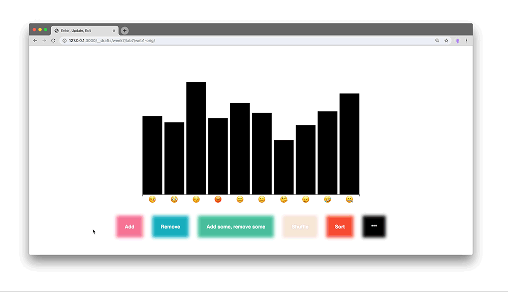
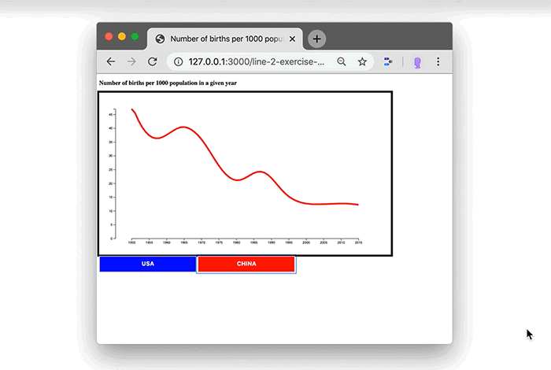

# Assignments

<!-- ##### 👾 Coding Exercise 1 (Foundation)

*Due this Wednesday, January 27:*

- Do this assignment first (strongly recommended)
-  We will spend 50% of our time in this course coding. Having a shared foundation for this is **extremely important**. I will always be there to support and assist you with problems you encounter. For now, please work your way through 👾 [Coding Exercise 1 ~ Foundation](../coding-exercises/exercise1-foundation) and submit your work in the end.
- Here is a thorough, interactive ``basic-javascript`` tutorial if you want to brush up your skills: [Basic JavaScript](https://learn.freecodecamp.org/javascript-algorithms-and-data-structures/basic-javascript/). And [here](https://www.codecademy.com/learn/introduction-to-javascript) is Codecadey's version. -->

<!-- ##### 🖍 Dear Data: Reading Visualizations

*Due Monday, February 1:*

- Dear Data is a project and book by Giorgia Lupi and Stefanie Posavec. We can learn a lot from them about visualizing data. This assignment is explained in [this spreadsheet](https://docs.google.com/spreadsheets/d/1PTTTbewj2zsqgztBhNZKB2ipunpI7jiok2tmm_kfhXE/edit?usp=sharing). Make sure to first read the introduction, then claim and study two visualizations. Be prepared to explain them in the next class. -->

<!--
##### 👾 Coding Exercise 2 (Form Data, plain JS)

*Due Wednesday, February 3:*

- Create a Google Form collecting data of the "linear scale" type (like we did in this week's Lab)
- collect responses from at least 10 people (e.g. send it to people in this class (use Slack), or open the form on your phone and walk around the cafeteria!)
- use the techniques used in [the lab](../labs/lab1/) to
- export the data in `json` format
- transform it to an array with average values
- build a bar graph using JavaScript
  - be creative and make it look more fun than my example!
- the last two points can be worked on simultaneously (you don't need all the responses to start working on the code)
- [how to collect and use data with Google Forms](../labs/collect-data-google-form)
- When you are done, post links to Code and the Live Website to the [Class Wiki](https://github.com/leoneckert/critical-data-and-visualization-spring-2021/wiki).

##### 👁 Watch this talk by Mike Bostock, Eyeo 2013
*Due Wednesday, February 3:*
- Find the talk [here]([talk](https://vimeo.com/69448223). -->

<!-- ##### 📖 Reading 1 (Data Intro)

*Due Sunday(!), February 7, at noon:*

- Find this Reading Assignment [here](../readings/reading1). -->

<!-- ##### 💡 Data Zine Subject Proposal

*Due Monday, February 8:*

- Take a good amount of time ideating about your subject for the [Data Zine Project](../projects/data-zine). This [excerpt](https://drive.google.com/file/d/1BEVAqv67rDhuNVVjKETDDTeW09orCNxy/view?usp=sharing) from Dear Data might help to envision this process.
- In the next class, be prepared to introduce your subject.
- Remember that ultimately, your dataset should have at least 20 individual data points, each with at least four features.
- The phenomenon you pick must be something that occurs over time.
- It is highly recommended to consider a phenomenon that has nothing to do with technology and that you find poetic. -->

<!-- ##### 👾 Coding Exercise 3 (Data-binding, JSON)

*Due Wednesday, February 10:*

- Data
  - submit a JSON file together with your Coding Exercise that demonstrates the start of your data collection for the Data Zine
- Code
  - Watch the videos from [the lab](../labs/lab2) and read the notes.
  - Read them again, and email me questions you have. Book my [office hours](https://calendar.google.com/calendar/u/0/selfsched?sstoken=UUE0X1AyMVlCNnpyfGRlZmF1bHR8ZTBmYjk2MTcyMjZkZmUwMzhjYTllN2IxMzlkMmQ4MTU), too, if anything is unclear (it's totally normal!).
  - Use D3 to turn the dataset you are currently collecting (for the Data Zine) into shapes.
  - Do not worry about visualizing the data effectively, but be creative in the aesthetics.
  - create any shapes from it and use data functions (video 3) in at least one spot in such a way that the value of your data point affects the shape you created using D3.
  - push your work to your repo and submit a link to the [Class Wiki](https://github.com/leoneckert/critical-data-and-visualization-spring-2021/wiki) -->

<!-- ##### 📖 Reading 2 (Data Bias)

*Due Sunday(!), February 21, at noon:*

- Find this Reading Assignment [here](../readings/reading2). -->

<!-- ##### 👾 Coding Exercise 4 (Grouping Elements)

*Due Wednesday, February 24:*

- Visualize your data making use of group (<g>) elements
- Your data points have multiple categories (names, values, labels etc.). Make each category affect a different aspect of a visual representation in a group.
- Take [this example](https://drive.google.com/file/d/1Qmnp0l9GegI6pG968rzsbm81SUIkcVPD/view?usp=sharing) by Giorgia Lupi. Each shape is a group of other shapes with attributes that represent different aspects of the data. She describes her logic on the back of the postcard. Create your own such logic for your data, and group shapes with different attributes into svg group elements.
- This is an exercise, not a project in its own right. You can work on your Data Zine alongside this exercise.
- Since this exercise, include rather more elements (for practice) in each group than (for stylistic choice) few. -->

<!-- ##### ✂️ Data Zine Paper Prototype

*Due Wednesday, February 24:*

- Print out [the template](https://drive.google.com/file/d/1cTKq3KGXeicckOdh-PQVKqRxWS6HN7Um/view?usp=sharing) on A3-sized paper, or [this template](https://drive.google.com/file/d/1HVQckA9IcByhOhiY3FU6FDwN1s7GXeQH/view?usp=sharing) on A4-size paper.
- Sketch out where you are planning to put which information (graphic and descriptive text). Remember you can create more than one visualization to illustrate different aspects of your data set.
- Scan your prototype, push it to your repository and add a link to the [Class Wiki](https://github.com/leoneckert/critical-data-and-visualization-spring-2021/wiki).

##### 📊 Read Edward Tufte's texts on Data Visualization

*Due Wednesday, February 24:*

- Read the following Chapters of The Visual Display of Quantitative Information by Edward R. Tufte:
- "Graphical Excellence"
- "Graphical Integrity"
- "Sources of Graphical Integrity and Sophistication"
  - I highly recommend getting a physical copy from the library. A [digital version](https://drive.google.com/file/d/1z-dc0YQbjw9V-zSbGmswiCdIlLi7PQ6f/view?usp=sharing) can be found here. -->

<!-- ##### 📖 Reading 3 (Surveillance Capitalism)

*Due Sunday(!), Feb 28, at noon:*

- Find this Reading Assignment [here](../readings/reading3). -->

<!-- ##### 🏗 Finished version of Data Zine

*Due Wednesday, March 3:*

- Finish your Data Zine using the [coding template](../projects/data-zine/coding-template.zip).
- Take notes of problems and difficulties you are running into.
- Make a copy of the project titled "datazine-WIP" ("WIP = Work In Progress") and post it the [Class Wiki](https://github.com/leoneckert/critical-data-and-visualization-spring-2021/wiki).
 -->

<!-- ##### 🖼 Data Zine

*Due Monday, Mar 8:*

- Find this Project [here](../projects/data-zine). -->

<!-- ##### 📖 Reading 4 (Prediction & Uncertainty)

*Due Sunday(!), March 14, at noon:*

- Find this Reading Assignment [here](../readings/reading4). -->

<!-- ##### 🤹 Two Data Stories  

*Due Monday, March 15:*
- Find two articles that tell a story with data and data visualization.
  - Supply links to them in a markdown file alongside 2-3 sentences explaining what they are about. Push the file and add a link to the [Class Wiki](https://github.com/leoneckert/critical-data-and-visualization-spring-2021/wiki).
  - Be prepared to explain what you enjoy about these articles and the way they use data / data visualization.
  - finding your own sources is highly encouraged. Nevertheless, here are potential sources: [nytimes](https://www.nytimes.com/interactive/2020/12/30/us/2020-year-in-graphics.html), [washingtonpost](https://www.washingtonpost.com/graphics/2018/ns/best-graphics/), [fivethirtyeight](https://fivethirtyeight.com/), [pudding.cool](https://pudding.cool/). -->

<!-- ##### 👾 Coding Exercise 5 (Roesling's Graph)

*Due Wednesday, March 17:*
- watch the first 5 minutes of [this video](https://www.ted.com/talks/hans_rosling_the_best_stats_you_ve_ever_seen?language=en).
- this weeks assignment is to rebuild the visualization from the video.
- download the [Exercise Code](../labs/lab6/rosling-start.zip) first.
- study [this highlevel overview](../labs/lab6/assets/rosling-start-explained.jpg) of what you will find in the code.
- Apply the learning from [Lab 6]((../labs/lab6) to visualize the data dynamically.
  - You will mostly be working in section "C" of the code (as labelled in screenshot below).
  - section A is also good to study because you should use the scales for datapoints x postition, y position and radius (if you do circles).
  - the `drawViz` function (section C) is being called every second. Inside it, you can use the array `currentYearData` - at every function call it carries a new set of data (of that current year).
  - you will need to:
    - bring the datapoints onto the page.
    - define what should happen with **entering** elements
    - define what should happen with **exiting** elements
- your result may look like [this](../labs/lab6/assets/rosling-result.gif) - but do feel free to style things differently and be creative in your design
- push your work to your repo and submit a link to the [Class Wiki](https://github.com/leoneckert/critical-data-and-visualization-spring-2021/wiki) -->

<!-- ##### 🍱 Three Good Datasets

*Due Wednesday, March 17:*
-_
- Take a deep dive into the datasets that you can find online.
  - Find three different datasets that you like, write a short paragraph highlighting what they are about and how you could imagine building a project around them.
  - collect those notes in markdown file, push to your repo and submit a link to the [Class Wiki](https://github.com/leoneckert/critical-data-and-visualization-spring-2021/wiki).
  - Find some sources for datasets in our [Resources Page](https://github.com/leoneckert/critical-data-and-visualization-spring-2021/tree/main/other/resources).
    - if you find other cool sources (both english and Chinese), consider [submitting them to a collection](https://docs.google.com/forms/d/e/1FAIpQLScfgFIBxAlW9Qz7t2jO6GViJ8y0utwFQBdEQORXuNMBkKTE8Q/viewform?usp=sf_link) I have started 😊
    - Dedicate time to this research, find something that you feel connected to and inspired by -> you will spend about seven weeks dealing with the subject you choose, pick something exciting.
    - What matters is your passion for the subject as well as the potential for creative visualizations of it.
    - keep your mind open to the possibility of collecting or scraping an interesting dataset - if this is something of interest to you, I will assist and advise you. -->

<!-- ##### 🚀 5x20seconds: What's it all about?
*Due Monday, March 22:*
- Prepare a very short presentation about your favorite of the three subjects your pre-selected.
- Each of you will present their topic in this format:
  - 5 slides that can only contain images (no text!)
  - 20 seconds per slide as you talk along explaining your interest and what you hope to make visible through your project
  - practice your text and its timing (email it to me by Sunday if that helps)
  - this is a VERY short presentation, do not invest more than maximum (!) 2 hours to prepare it.
  - Add your 5 slides to this [Drive Folder](https://drive.google.com/drive/folders/1yDiWxc0uAIvAV7QSi8Dbip6lckfKkTME?usp=sharing) and add a link to the [Class Wiki](https://github.com/leoneckert/critical-data-and-visualization-spring-2021/wiki) by Sunday night, please. -->

<!-- ##### 👾 Coding Exercise 6 (Mastering Transitions)

*Due Wednesday, March 24:*
- Finish the Website we started in [Lab 7](../labs/lab7).
  - You should be feeling comfortable with all the techniques used in it,
  - Experiment a lot
    - play with transitions, ease, delays, durations ([d3-transition](https://github.com/d3/d3-transition), [d3-ease](https://github.com/d3/d3-ease), [all ease functions](https://observablehq.com/@d3/easing-animations))
    - make sure there is no glitch, no matter which button is pressed, things must transition smoothly to show the new data.
    - surprise us on the last button!
  - add your finished work to the [Class Wiki](https://github.com/leoneckert/critical-data-and-visualization-spring-2021/wiki)
 -->

<!-- ##### 🕵️ Outline Research

*Due Monday, March 29:*

- Next class is a 1-on-1 Check-In for the Contextual Report.
  - You must have an ultimate decision on the dataset you will be using
    - Download the dataset and take a look at it in Atom. Does it look usable for your project?
  - Have a solidified idea about the approach: how is your story told, what is the story?
  - Bring in a list of sources (ideally) and/or questions you will need or research for your report. -->

<!-- ##### 👾 Coding Exercise 7 (Line Generators)

*Due Wednesday, March 31:*

- modify the code created in [lab 8](../labs/lab8) to make the visualization behave in this way:
 -->

##### 🗺 Data Story: Contextual Report
*Due Monday, April 12:*
- Find this project [here](../projects/data-story-and-contextual-report-presentation).

##### 📖 Reading 5 (Ethics)

*Due Sunday(!), April 18, at noon:*

- Find this Reading Assignment [here](../readings/reading5).

##### 👾 Coding Exercise 8 (Maps)

*Due Wednesday, April 21:*

- Set yourself a visual goal for a map exercise (e.g. I want a dot to move from location to location).
- This is not a "project", but an exercise and opportunity to create something visually pleasing.
- Below are examples.
  - play with different projections.
  - try to transition between different projections.
  - try to transition between different geojson data sets.
  - or try the [geoOrthographic](https://observablehq.com/search?query=geoOrthographic) projection (get [abstract](https://twitter.com/mbostock/status/932784677185765377?lang=en) 😉)
  - be playful.

