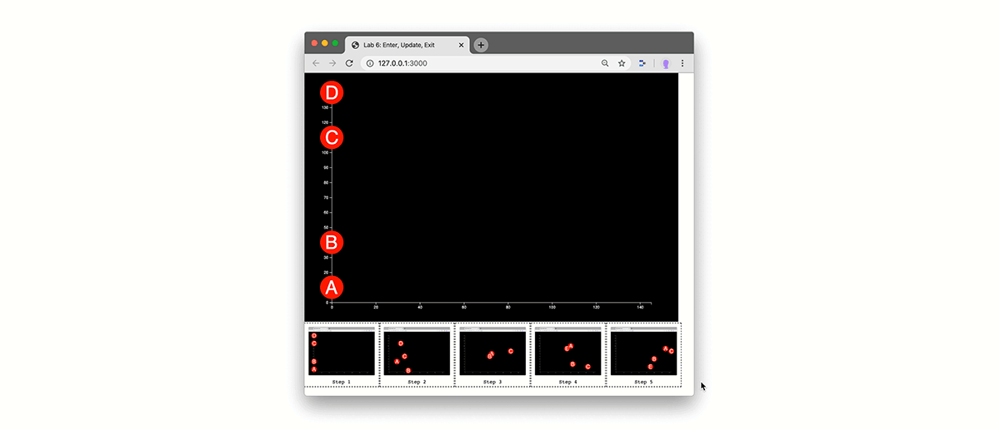

## Lab 6 - Enter, Update, Exit, Transitions

NOTE: inside the videos, I ACCIDENTALLY speak of "Lab 7" -- this is Lab 6. Please apologize.

#### today's agenda
- In the lab, we are building this visualization:
  - 
- Please download the[ Exercise Files](enter-update-exit-transition-start.zip), then follow these tutorials:
  - Part 1- Data & Setup ([video](https://drive.google.com/file/d/1A1hVaqTvuVV2z00KdfgbhCoKjgauUkt5/view?usp=sharing) 28:17)
  - Part 2 - Enter, Update, Exit ([video](https://drive.google.com/file/d/1bkZ1hLWDpCGcIHJ09GG1-epQqJUL-fkp/view?usp=sharing) 23:17)
  - Part 3 - Transitions ([video](https://drive.google.com/file/d/1v9GnrG0J8gvs1GBsPHsSP9Sntz34Bpt4/view?usp=sharing) 9:35)
  - Part 4 - Data Keys ([video](https://drive.google.com/file/d/1tX4l9DxaSebej9OQ2LP1RHY-t-3QG7m0/view?usp=sharing) 7:41)
