#### The Project
A "zine" is a self-published magazine that is typically produced at home and exists in only a very small number. For this project, students design the content of a zine that is only four pages long.
The zine contains a cover (page 1), a static visualization of the data you have collected over previous week(s) (page 2-3), as well as a visual and textual key explaining your methods (page 4). The design will be created in the browser using HTML, CSS, JS and particularly D3.js
[Dear Data](https://docs.google.com/spreadsheets/d/1PTTTbewj2zsqgztBhNZKB2ipunpI7jiok2tmm_kfhXE/edit#gid=0) by Giorgia Lupi and Stefanie Posavec serves as inspiration for this project.

#### The Data
Data is collected for 1-2 weeks. This requires attention and continuity. First, define a phenomenon that you plan to observe and the features you will make note of. For example, the phenomenon might be "seeing my reflection", and the features you take note of every time you see your own reflection could be your location, the reflective object, the exact time, whether it was inside or outside, and so on.
Your dataset should have at least 20 individual data points, each with at least four features. I recommend to collect more data (and features) first, and only decide which parts to use in the very end. The data must ultimately exist in JSON format. The phenomenon you pick must be something that occurs over time. It is highly recommended to consider a phenomenon that has nothing to do with technology and that you find poetic.
Again, take inspiration, but don't copy [Dear Data](https://docs.google.com/spreadsheets/d/1PTTTbewj2zsqgztBhNZKB2ipunpI7jiok2tmm_kfhXE/edit#gid=0).

#### The Visualization
The goal of this visualization is display all data the data points and their features at once. The focus is on the artistic, visual design, and not on the communication of information.

#### Delivery

When you push your project to GitHub, include a `README.md` file with screenshots of every page and a link to the live website. In text, cover the following questions:

- What data did you choose to collect?
- How did you collect it, was was the routine?
- Why did you choose to visualize the data in this way?
- What can be seen in the visualization? Does it reveal something you didn't expect?
- Did you make crucial compromises? Which ones?
- If this project had a larger scaler and wasn't designed for print, how would you imagine it to be?

#### Presentation
The presentation takes the form of a screen capture video with voice over.

- The video should be 2.5 minutes long.
- In the video "flick" through the pages on your screen.
- As you show the pages, discuss the questions mentioned above, add additional things that are worth mentioning. You can change the order, too, be yourself :)
- When you are done, drop the video into [this folder](https://drive.google.com/drive/folders/1-xcdL686J2pgMc5AWjN4pIk2UaqPOO_z?usp=sharing) and add a link to your Code, Live Website, and video to the [Class Wiki](https://github.com/leoneckert/critical-data-and-visualization-spring-2021/wiki).

#### Process (Coding Template)

You should start ideating about the subject of your project right now. This excerpt from Dear Data might help to envision this process. The building of the website comes afterwards (we haven't even started learning D3.js yet). For the project, I will supply a coding template - the only purpose of the template is to assure all zines will have the exact same size.

#### Useful Advice
The format of your zine is small. Keep this is mind when deciding on the size of texts you include. The visualization will be ultimately printed. Take into consideration how well contrasts appear on paper when you choose colors. Make test prints!

#### Recommended Timeline

- Week 2: Collect Data? (Start early, you will learn from mistakes)
- Week 3: Collect Data, First coding draft
- Spring Festival: Collect Data (this will contrast great with data collect during school time), Coding
- Week 4: Collect Data (Only if needed), Resolve coding questions
- Week 5: Final Coding
- Week 6: Presentation

#### Past students' work

##### Daisy:
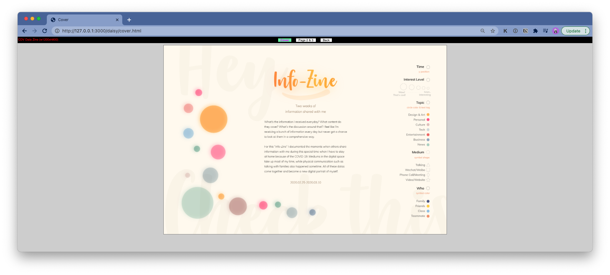
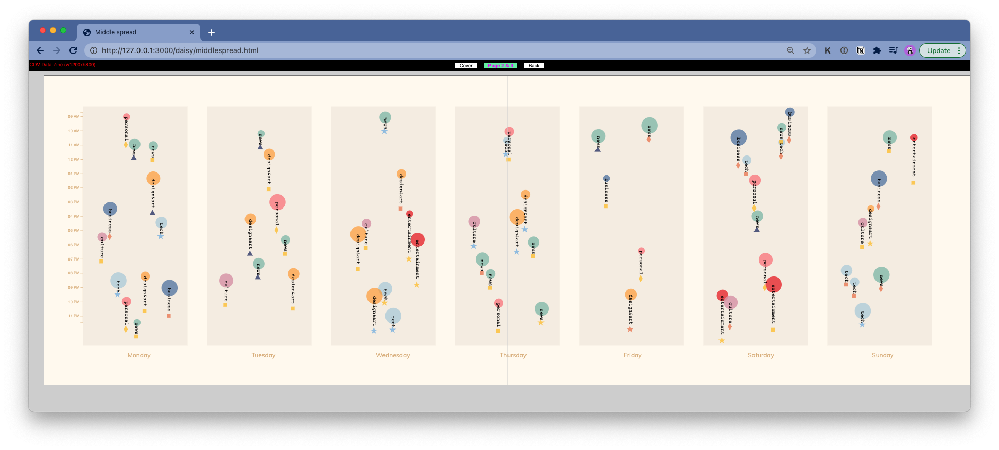
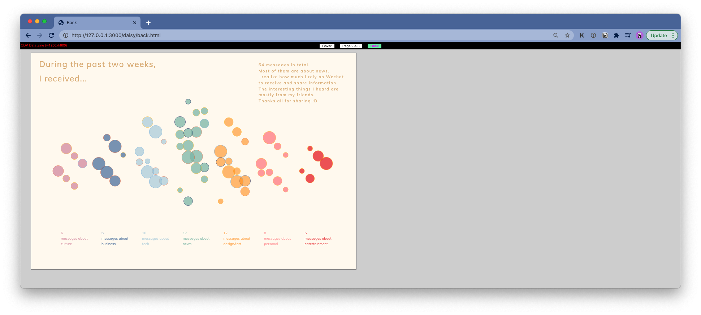

##### Lishan:
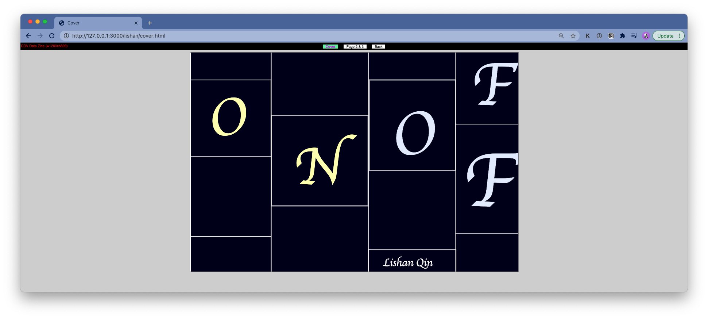
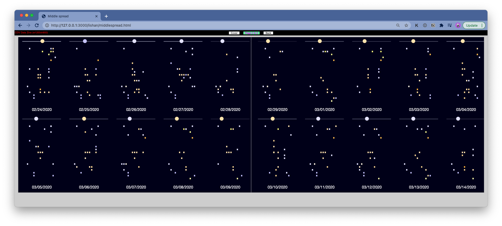
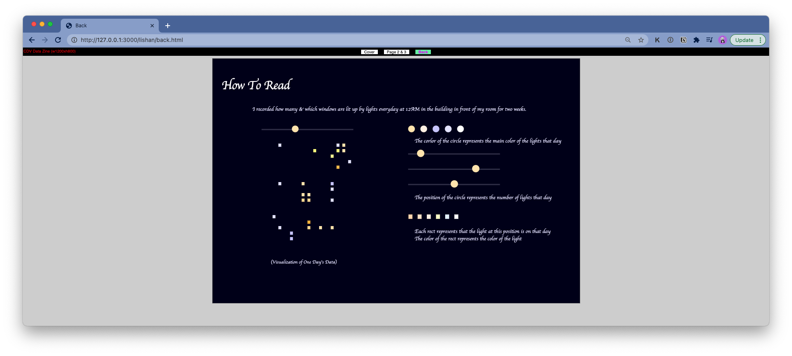

##### Shiny:

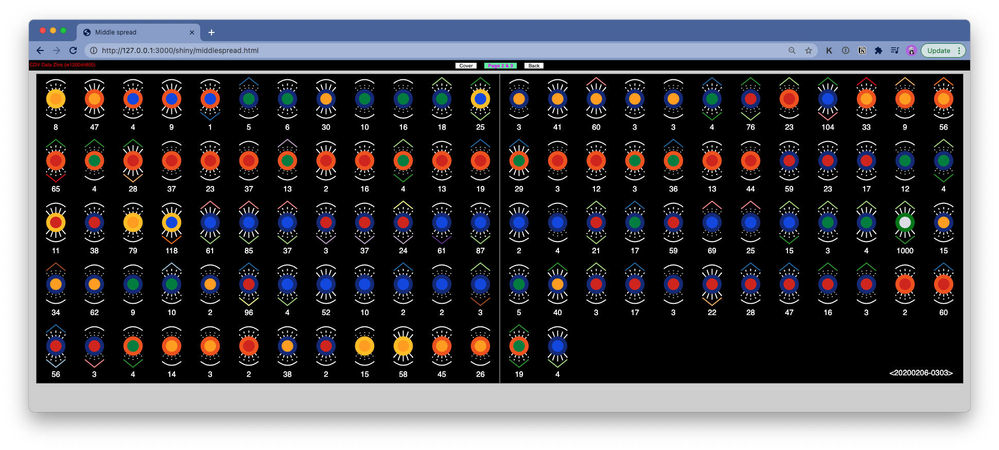
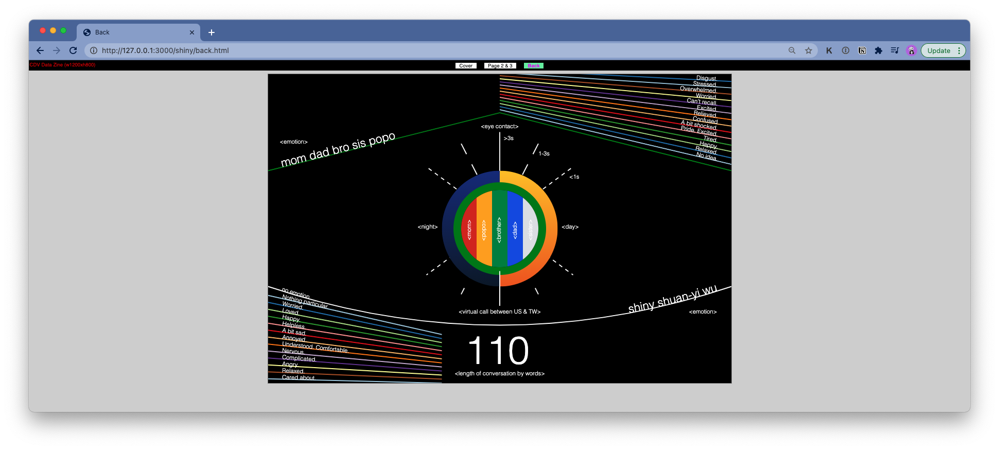

##### William:
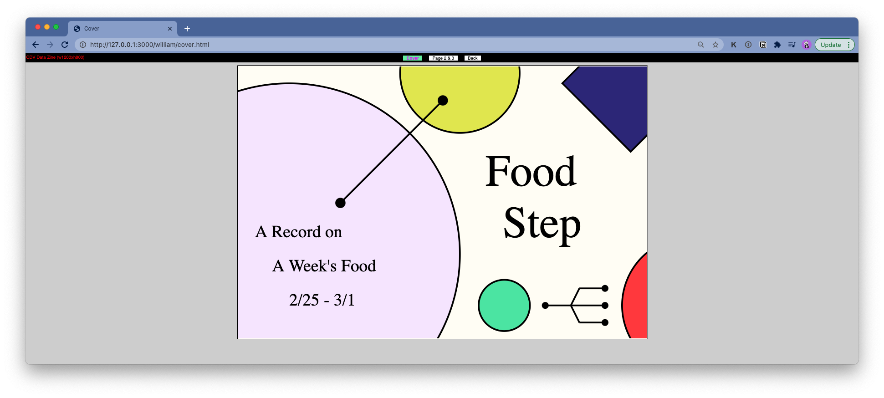
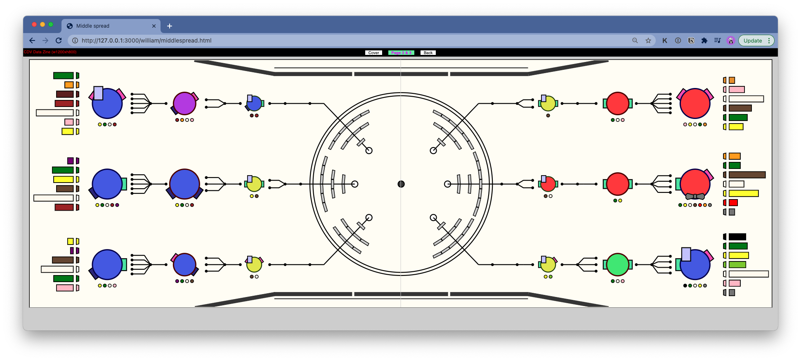
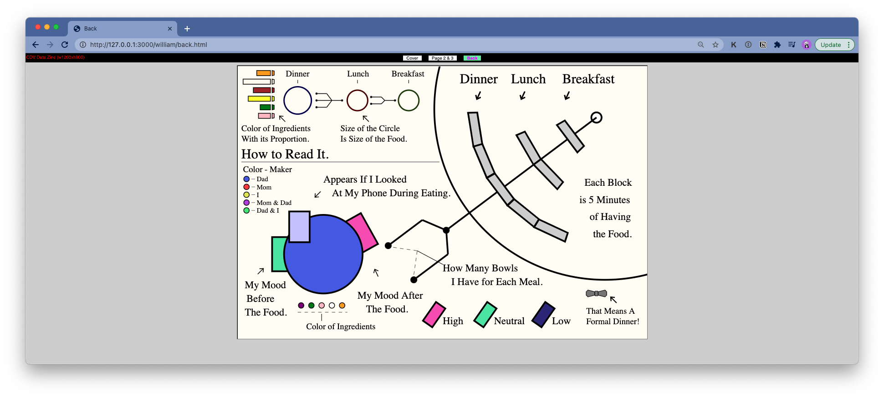
